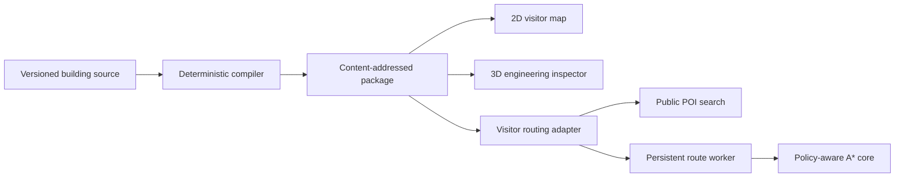

# VoiceGIS Indoor Spatial Twin

[](https://github.com/SanishKumar/voicegis-indoor-ar/actions/workflows/quality.yml)

An offline-oriented indoor spatial-intelligence project for compiling building data, calculating constraint-aware routes, inspecting spatial topology, and eventually delivering uncertainty-aware localization, voice control, and world-anchored guidance.

This repository is being rebuilt in public from an earlier hospital-navigation prototype. The original state is preserved at [`prototype-v0`](https://github.com/SanishKumar/voicegis-indoor-ar/tree/prototype-v0).

## Current status

The web application navigates a **synthetic two-floor reference building**. It is an engineering fixture, not surveyed venue data and not safe for real-world deployment.

Implemented today:

- A versioned TypeScript source model and strict JSON Schema
- A deterministic building compiler with a content-addressed package manifest
- Semantic validation for geometry, portals, connectors, accessibility, and reachability
- A two-floor reference package with public and restricted spaces, lift, stairs, POIs, and localization anchors
- A package-driven 2D visitor map and React Three Fiber engineering inspector
- Floor isolation, exploded view, semantic selection, graph overlays, and anchor overlays
- Multi-floor A* routing in a persistent Web Worker
- Explicit standard versus accessible routing and fail-closed restricted edges
- Versioned operational overlays for deterministic corridor or connector closures
- Route receipts with package hash, profile, closures, connector choice, and exclusion counts
- Vertical instructions such as “take the elevator to Level 1”
- Public-only fuzzy search with declared destination aliases
- Automated lint, type, test, deterministic-compile, and production-build checks
- A camera-overlay **preview** for instruction experiments

Not implemented yet:

- Surveyed or imported real-building geometry
- Real user localization, movement tracking, or uncertainty estimation
- Offline package caching, signatures, distribution, or rollback
- World-anchored AR, pose alignment, occlusion, or automatic progress
- VoiceGIS command execution
- Session recording, deterministic replay, or physical-walk benchmarks

The camera view is deliberately labeled **Camera Preview** because its graphics are screen-aligned. It does not know the device pose or the user's position and should not be described as AR.

## Why this exists

Indoor navigation becomes difficult where GPS stops being useful and mistakes are stressful: hospitals, transit hubs, campuses, and public facilities. The long-term system is intended to make four hard problems work together:

1. Compile source floor plans into validated, versioned building packages.
2. Fuse visual, inertial, and explicit anchor observations while exposing uncertainty.
3. Calculate explainable routes under accessibility and operational constraints.
4. Present the same route through a 3D map, mobile AR, and deterministic voice operations.

An LLM may interpret a request, but it must not decide whether a corridor is accessible or an emergency route is safe. Those decisions belong to typed data, routing policy, and auditable execution receipts.

## Current architecture



The source JSON is authored data. The compiled package is the only runtime authority for geometry, semantics, search, and routing. Clients do not repair malformed topology.

## Run locally

Requirements:

- Node.js 22 or newer
- npm

```bash
npm ci
npm run dev
```

Run the same quality gate used by CI:

```bash
npm run check
```

Compile or verify the reference package directly:

```bash
npm run compile:reference
npm run compile:check
```

## Repository map

```text
buildings/reference-medical-centre/
├── source/                    authored synthetic building source
└── compiled/                  deterministic package and validation report

packages/
├── spatial-schema/            versioned types, JSON Schema, and shape validation
└── map-compiler/              semantic validation and deterministic graph compiler

src/
├── components/                visitor map, 3D inspector, navigation, and camera preview
├── context/                   navigation state and user preferences
├── data/compiledBuilding.ts   runtime adapter over the compiled package
└── engine/                    routing, search, graph checks, and view models

docs/
├── adr/                       architecture decision records
├── architecture/              system boundaries
├── build-in-public.md         public progress-post drafts
└── roadmap.md                 evidence-based delivery phases
```

## Next engineering milestone

The next Phase 2 slice is an offline package cache with explicit version activation and rollback. Cached content must be verified against its manifest hash before activation, and a failed update must leave the last known-good package available. The localization/replay contracts follow after package lifecycle is trustworthy.

See [the delivery roadmap](docs/roadmap.md) and [the architecture direction](docs/architecture/overview.md).

## Review wanted

Useful review is especially welcome from people working with:

- Indoor GIS, IndoorGML, BIM, IFC, CAD, or floor-plan conversion
- Accessibility and hospital wayfinding
- SLAM, visual localization, sensor fusion, or map matching
- Graph routing and dynamic path planning
- ARCore, ARKit, AR Foundation, or WebXR

Please challenge the data model and failure handling before the visuals. The most useful question is not “Does the arrow look good?” but “What evidence would make this safe to trust during a real walk?”

## License

No open-source license has been selected yet. Until one is added, the repository remains all-rights-reserved by default.
