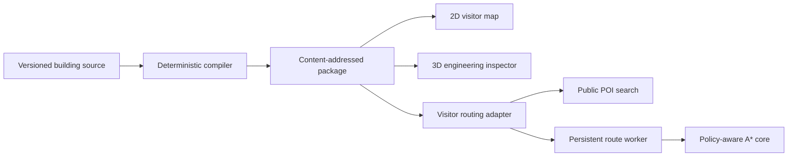

# VoiceGIS Indoor Spatial Twin

[](https://github.com/SanishKumar/voicegis-indoor-ar/actions/workflows/quality.yml)

An offline-oriented indoor spatial-intelligence project for compiling building data, calculating constraint-aware routes, inspecting spatial topology, and eventually delivering uncertainty-aware localization, voice control, and world-anchored guidance.

This repository is being rebuilt in public from an earlier hospital-navigation prototype. The original state is preserved at [`prototype-v0`](https://github.com/SanishKumar/voicegis-indoor-ar/tree/prototype-v0).

## Current status

The web application now navigates **Asterion University Medical Center**, an original
four-level academic-hospital benchmark. It is deliberately fictional—not surveyed venue
data, not a reconstruction of a real hospital, and not safe for physical navigation.

The smaller two-floor reference building remains in the repository as a stable compiler
and localization regression fixture.

Implemented today:

- A versioned TypeScript source model and strict JSON Schema
- A deterministic building compiler with a content-addressed package manifest
- Semantic validation for geometry, portals, connectors, accessibility, and reachability
- A four-level benchmark package with 60 semantic spaces, 36 POIs, 56 portals, four
  vertical-circulation systems, and 9 localization anchors
- A package-driven architectural visitor plan with wall openings, door swings,
  structural references, circulation cores, and high-contrast route casing
- An architectural React Three Fiber spatial twin with the selected route projected
  through its actual floors and vertical connector
- Full-height walls with portal openings, door and gate assemblies, lift shafts, stairs,
  clinical equipment cues, labels, lighting, and shadows
- Floor isolation, exploded view, semantic selection, graph overlays, and anchor overlays
- Multi-floor A* routing in a persistent Web Worker
- Explicit standard versus accessible routing and fail-closed restricted edges
- Versioned operational overlays for deterministic corridor or connector closures
- Route receipts with package hash, profile, closures, connector choice, and exclusion counts
- Deterministic all-public-lifts-outage replay: standard routing uses stairs while
  wheelchair routing reports no compliant route
- Browser package verification with atomic active/previous cache state and rollback
- Typed localization observations, covariance-aware estimates, and deterministic replay
- Synthetic checkpoint evaluation with explicit high/degraded/lost quality states
- Same-floor, uncertainty-gated route matching with explicit rejection reasons
- Localization runtime states that freeze guidance until trusted-anchor recovery
- Vertical instructions such as “take the elevator to Level 1”
- Public-only fuzzy search with declared destination aliases
- Automated lint, type, test, deterministic-compile, and production-build checks
- A route-aware camera-guidance **preview** with explicit camera, heading, position,
  and world-anchor readiness states
- Optional device-heading permission and route-bearing comparison while keeping
  screen-aligned guidance clearly separate from world-anchored AR

Not implemented yet:

- Surveyed or imported real-building geometry
- Real sensor ingestion, surveyed localization traces, or physical accuracy evidence
- Remote package download, signatures, distribution, or runtime hot-swap
- World-anchored AR, pose alignment, occlusion, or automatic progress
- VoiceGIS command execution
- Live device relocalization, automatic progress, or physical-walk benchmarks

The camera view is deliberately labeled **Guidance Preview** because its route ribbon
is screen-aligned. On supported devices it can compare compass heading with the route
bearing, but it still does not know the camera pose, a surveyed building-to-world
transform, or the user's live position. It should not be described as AR.

## Why this exists

Indoor navigation becomes difficult where GPS stops being useful and mistakes are stressful: hospitals, transit hubs, campuses, and public facilities. The long-term system is intended to make four hard problems work together:

1. Compile source floor plans into validated, versioned building packages.
2. Fuse visual, inertial, and explicit anchor observations while exposing uncertainty.
3. Calculate explainable routes under accessibility and operational constraints.
4. Present the same route through a 3D map, mobile AR, and deterministic voice operations.

An LLM may interpret a request, but it must not decide whether a corridor is accessible or an emergency route is safe. Those decisions belong to typed data, routing policy, and auditable execution receipts.

## Current architecture


```mermaid
flowchart LR
  Source["Versioned building source"] --> Compiler["Deterministic compiler"]
  Compiler --> Package["Content-addressed package"]
  Package --> Map["2D visitor map"]
  Package --> Twin["3D engineering inspector"]
  Package --> Adapter["Visitor routing adapter"]
  Adapter --> Search["Public POI search"]
  Adapter --> Worker["Persistent route worker"]
  Worker --> Core["Policy-aware A* core"]
```

The source JSON is authored data. The compiled package is the only runtime authority for geometry, semantics, search, and routing. Clients do not repair malformed topology.

## Run locally

Requirements:

- Node.js 22 or newer
- npm

```bash
npm ci
npm run dev
```

Run the same quality gate used by CI:

```bash
npm run check
```

Compile or verify the reference package directly:

```bash
npm run compile:reference
npm run compile:check
npm run compile:asterion
npm run compile:asterion:check
```

## Repository map

```text
buildings/asterion-medical-center/
├── source/                    authored fictional benchmark
├── compiled/                  deterministic package and validation report
└── operations/                reproducible public-lift outage scenario

buildings/reference-medical-centre/
├── source/                    authored synthetic building source
└── compiled/                  deterministic package and validation report

packages/
├── spatial-schema/            versioned types, JSON Schema, and shape validation
└── map-compiler/              semantic validation and deterministic graph compiler

src/
├── components/                visitor map, 3D inspector, navigation, and camera preview
├── context/                   navigation state and user preferences
├── data/compiledBuilding.ts   runtime adapter over the compiled package
└── engine/                    routing, search, graph checks, and view models

docs/
├── adr/                       architecture decision records
├── architecture/              system boundaries
├── build-in-public.md         public progress-post drafts
└── roadmap.md                 evidence-based delivery phases
```

## Next engineering milestone

Phase 2 still needs runtime consumption of a non-bundled active package, including storage-quota and multi-tab coordination. Phase 3 now has deterministic replay, gated route matching, and explicit recovery state transitions; the next slice is a privacy-preserving real-walk ingestion contract and benchmark metadata. Remote distribution and signatures remain later venue-platform work.

See [the delivery roadmap](docs/roadmap.md) and [the architecture direction](docs/architecture/overview.md).

## Review wanted

Useful review is especially welcome from people working with:

- Indoor GIS, IndoorGML, BIM, IFC, CAD, or floor-plan conversion
- Accessibility and hospital wayfinding
- SLAM, visual localization, sensor fusion, or map matching
- Graph routing and dynamic path planning
- ARCore, ARKit, AR Foundation, or WebXR

Please challenge the data model and failure handling before the visuals. The most useful question is not “Does the arrow look good?” but “What evidence would make this safe to trust during a real walk?”

## License

No open-source license has been selected yet. Until one is added, the repository remains all-rights-reserved by default.
