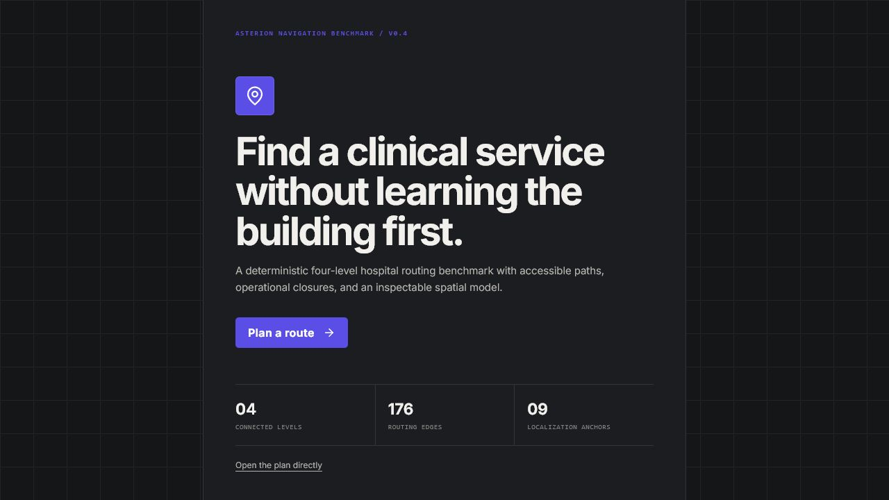
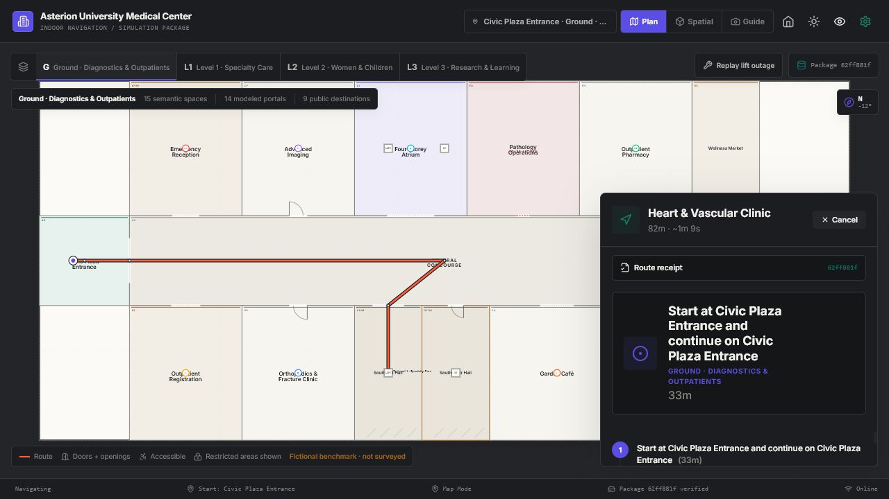
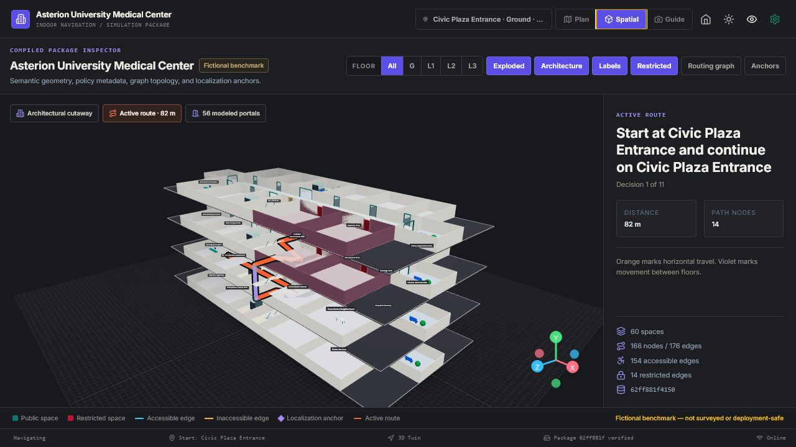
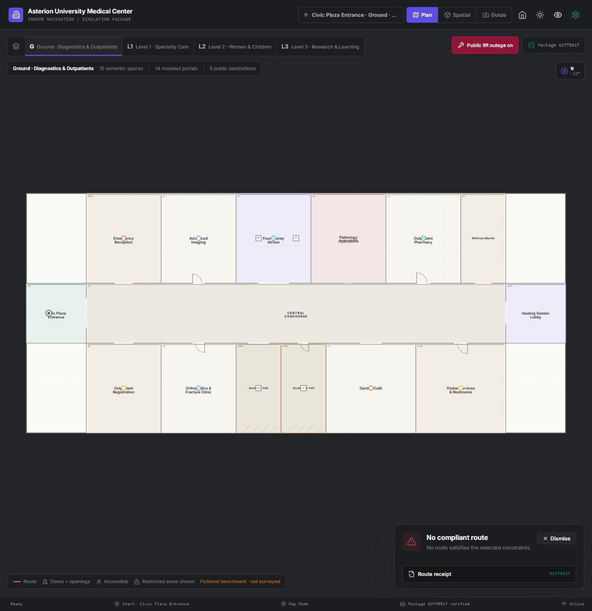
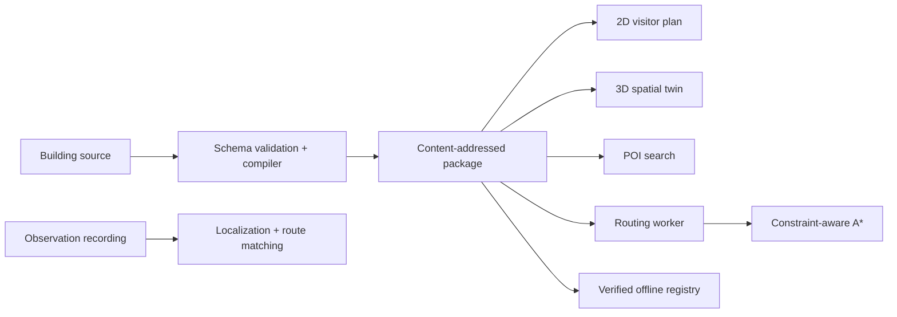

# VoiceGIS Indoor Spatial Twin

[](https://github.com/SanishKumar/voicegis-indoor-ar/actions/workflows/quality.yml)

An indoor-navigation platform built around versioned spatial data, deterministic routing, operational constraints, and shared 2D/3D presentation.

The repository includes a compiler, routing engine, browser application, offline package registry, localization replay core, and two unrelated runtime-switchable venue benchmarks.

## Product preview

<table>
  <tr>
    <td width="50%">
      
      <br><sub>Navigation benchmark overview</sub>
    </td>
    <td width="50%">
      
      <br><sub>Architectural plan and turn-by-turn route</sub>
    </td>
  </tr>
  <tr>
    <td width="50%">
      
      <br><sub>Route projected through the 3D spatial twin</sub>
    </td>
    <td width="50%">
      
      <br><sub>Fail-closed accessible routing during a lift outage</sub>
    </td>
  </tr>
</table>

## Try it in 60 seconds

```bash
npm run dev
```

Open `http://localhost:3000/check-in-codes.html` in a second window, then in the
app choose **Plan a route → Scan a check-in code** and point the camera at one.
You are checked in at the point the package declares, and can be routed step-free
to any published public destination — when the selected profile can prove a route
— with no beacons, no RF fingerprinting and no positioning service. Check-in and
routing run against the compiled package on the device.

The bundled venues are synthetic fixtures, each code still has to be physically
placed where the package says it is, and a cold reload with the network down is
not yet supported. Full script and the exact limits: [the 60-second demo](docs/demo.md).

## Core capabilities

### QR check-in

A code at a junction resolves against the anchors inside the compiled venue
package, giving a position fix on the right floor with no beacons and no lookup
service. Codes are generated from the package (`npm run codes`, gated by
`codes:check`), so the sheet in this repository can only encode payloads the
venue publishes, and every payload is round-trip tested through the decoder iOS
uses.

That guarantee stops at the printer. A sign already on a wall is outside version
control, so recompiling a venue can strand it while the repository stays
consistent; reprinting after a venue change is a field procedure.

The fix is only as good as the sign's placement, which is a physical measurement
per code and is not automated. Accuracy against a real building has not been
measured; the bundled venues are synthetic.

### Spatial package compiler

- Versioned TypeScript model and JSON Schema for floors, spaces, portals, POIs, connectors, and localization anchors
- Semantic validation for geometry, connectivity, accessibility, restrictions, and reachability
- Deterministic compilation with a content-addressed package manifest
- One compiled package shared by routing, search, the 2D plan, and the 3D viewer

### Routing and operations

- Multi-floor A* routing in a persistent Web Worker
- Standard and wheelchair routing profiles
- Fail-closed restricted and inaccessible edges
- Versioned closures for corridors and vertical connectors
- Route receipts containing the package hash, routing profile, applied closures, connector selection, and exclusion counts

### Navigation clients

- Architectural 2D plan with modeled openings, door swings, room codes, circulation cores, and route decision points
- React Three Fiber spatial twin with floor isolation, exploded view, semantic inspection, graph overlays, anchors, and active routes
- Camera guidance view with route progress, optional device-heading alignment, and readiness diagnostics
- Public POI search with aliases and floor-aware results

### Package and localization runtime

- SHA-256 package verification
- Atomic active/previous package state in IndexedDB
- Deterministic localization observation replay
- Covariance-aware estimates and explicit quality states
- Route matching with uncertainty gates and relocalization recovery rules

## Architecture


```mermaid
flowchart LR
  Source["Building source"] --> Compiler["Schema validation + compiler"]
  Compiler --> Package["Content-addressed package"]
  Package --> Plan["2D visitor plan"]
  Package --> Twin["3D spatial twin"]
  Package --> Search["POI search"]
  Package --> Worker["Routing worker"]
  Package --> Registry["Verified offline registry"]
  Worker --> Policy["Constraint-aware A*"]
  Replay["Observation recording"] --> Localization["Localization + route matching"]
```

The authored building source is compiled before runtime. Clients load a verified
package artifact by URL or file and do not repair malformed topology
independently.

## Included venues

`buildings/asterion-medical-center` contains the Asterion University Medical Center benchmark:

- 4 floors
- 60 semantic spaces
- 56 modeled portals
- 32 public POIs and 4 restricted operational POIs
- 4 vertical-circulation systems
- 9 localization anchors
- 216 routing nodes and 224 edges

The package includes a reproducible public-lift outage used to exercise standard and wheelchair routing behavior. A smaller two-floor building is retained as a stable compiler and localization regression fixture.

`buildings/harbor-exchange` is a structurally different two-floor ferry, market,
and community venue with a lift, stair, escalator, ten public destinations, and
three localization anchors. Inspector can switch between both compiled packages
at runtime without a rebuild.

## Run locally

Requirements:

- Node.js 22+
- npm

```bash
git clone https://github.com/SanishKumar/voicegis-indoor-ar.git
cd voicegis-indoor-ar
npm ci
npm run dev
```

The development server prints the local URL after startup.

## Useful commands

| Command                          | Purpose                                                                                                     |
| -------------------------------- | ----------------------------------------------------------------------------------------------------------- |
| `npm run check`                  | Run lint, type checking, tests, deterministic package checks, replay verification, and the production build |
| `npm test`                       | Run the Vitest suite                                                                                        |
| `npm run compile:asterion`       | Recompile the Asterion building package                                                                     |
| `npm run compile:asterion:check` | Verify that the committed Asterion package is reproducible                                                  |
| `npm run compile:harbor:check`   | Verify that the committed Harbor Exchange package is reproducible                                           |
| `npm run venues:sync:check`      | Verify browser-served package artifacts match compiler output                                               |
| `npm run replay:reference`       | Regenerate the reference localization replay report                                                         |
| `npm run replay:check`           | Verify the committed replay report byte-for-byte                                                            |
| `npm run codes`                  | Regenerate the printable check-in code sheet from the compiled venue packages                               |
| `npm run dev:mobile`             | Serve over HTTPS on the LAN so a phone can reach `#/recorder` and use its motion sensors                     |
| `npm run evidence`               | Seal a capture and its predeclared manifest into an evidence artifact, or verify one                        |
| `npm run build`                  | Create a production build in `dist/`                                                                        |

## Repository structure

```text
buildings/
├── asterion-medical-center/     four-level application benchmark
├── harbor-exchange/              two-level non-medical venue
└── reference-medical-centre/    compact compiler regression fixture

packages/
├── spatial-schema/              shared spatial types and JSON Schema
├── map-compiler/                validation and deterministic graph compiler
└── localization-core/           observation replay and estimate pipeline

src/
├── capture/                     handset sensor adapter driving a capture session
├── components/                  plan, spatial twin, search, and guidance UI
├── context/                     navigation state and user preferences
├── data/                        compiled-package runtime adapter
└── engine/                      routing, topology, search, and view models

recordings/                      deterministic localization fixtures
docs/                            architecture decisions and technical reports
```

## Integration scope

Asterion is a synthetic benchmark bundled for development and testing. Deploying the system for a venue requires authorized building data, calibrated coordinate transforms, validated accessibility attributes, and physical route testing.

The camera guidance view is screen-aligned and can optionally compare device heading with route bearing. World-anchored guidance requires live localization and a surveyed building-to-device transform.

## Technical documentation

- [Architecture overview](docs/architecture/overview.md)
- [VenuePackage runtime contract](docs/architecture/venue-package-contract.md)
- [Asterion assumption audit](docs/architecture/asterion-assumption-audit.md)
- [Architecture decision records](docs/adr/)
- [Reference localization replay](docs/localization/reference-replay.md)
- [Sealing and checking an evidence artifact](docs/localization/evidence-artifact.md)
- [Recording a walk on a phone](docs/localization/recording-on-a-phone.md)
- [The 60-second demo](docs/demo.md)

## License

No open-source license has been selected. The repository is all-rights-reserved by default.
