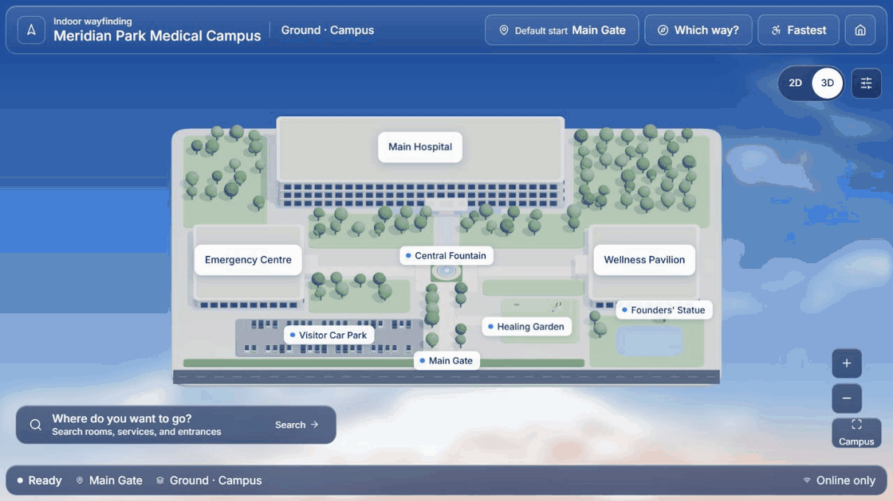
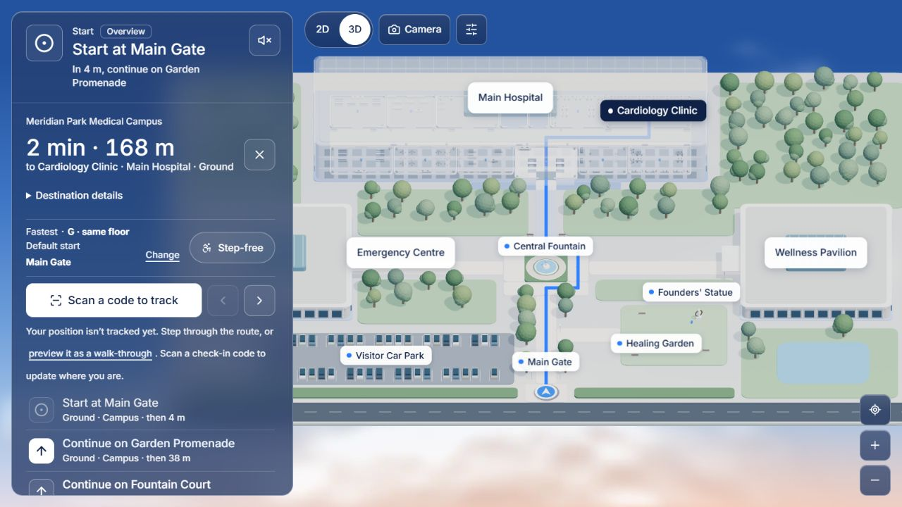
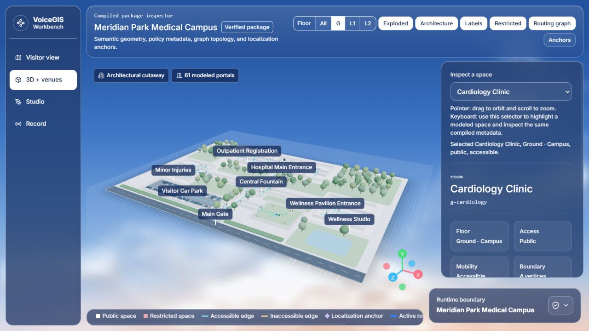

# VoiceGIS

[](https://github.com/SanishKumar/voicegis-indoor-ar/actions/workflows/quality.yml)

Find your way from the campus gate to the right room.

VoiceGIS is a browser-based wayfinding app for campuses and large buildings.
Search for a destination, choose a start or scan a check-in sign, and follow a
route through outdoor paths, building entrances and floors. The 2D plan and 3D
view share the same journey, so switching views keeps your place.



_Campus exploration and route preview in the included Meridian Park venue.
[View a still image](docs/media/campus.jpg)._

## From the grounds to the room

The campus map opens into the building you enter. Outside, buildings and
landmarks help you find your bearings; inside, rooms, corridors and floor
controls take over. You can explore another building without changing your
location, then use Recenter to return to your journey.

- Search rooms, departments, services and entrances, with their building and floor.
- Plan the fastest or a step-free route using the venue's access rules and closures.
- Switch between 2D and 3D, inspect the whole trip, or preview it one instruction at a time.
- Scan a venue's QR sign to establish a known location. Written and spoken directions use the same route.
- Use an installed visitor build offline after its first successful online load, while the browser retains its cache.



## Run it locally

Use Node.js 22+ and npm.

```bash
git clone https://github.com/SanishKumar/voicegis-indoor-ar.git
cd voicegis-indoor-ar
npm ci
npm run dev
```

Open the address printed by Vite (normally `http://localhost:3000`). Choose
**Somewhere else? Choose the place** on the welcome screen to select
**Meridian Park Medical Campus**, or open the campus directly:

```text
http://localhost:3000/?venue=/venues/meridian-park-campus.package.json#/visitor
```

To reproduce the route above, choose **Browse the map instead**, search for
**Cardiology Clinic**, and navigate from the default **Main Gate** start.
Use **3D** to see the buildings and **Campus** to return from an indoor view.

For a QR check-in, open `/check-in-codes.html` on another screen and scan a code
for the venue you selected. Phone camera and motion features need HTTPS;
`npm run dev:mobile` provides a local HTTPS server. See the
[phone testing guide](docs/field-testing.md) for setup and diagnostics.

## Maintain the map

The development app includes an operator workbench:

- **Inspector** (`#/inspector`): isolate floors, inspect spaces, and examine routes, graph connections and check-in anchors.
- **Studio** (`#/studio`): edit the building source, import DXF data, compile a preview, activate a verified package and roll back. Unpublished drafts survive switching tools in the same tab.
- **Recorder** (`#/recorder`): capture sensor observations for replay and investigation.



These tools use the same venue data as the visitor app. The public production
build leaves the operator screens out.

## How the data fits together

```text
Building source / DXF
        ↓
Schema and geometry checks → deterministic compiler
        ↓
Verified venue package
        ├── destination search and QR check-in
        ├── routing worker and turn instructions
        ├── 2D / 3D visitor map
        └── Inspector, Studio and offline storage
```

A package describes floors, spaces, doors, destinations, connectors and
check-in points, plus grounds and building footprints for a campus. Routing
runs on the device. Restricted paths, declared closures and inaccessible
connections are excluded according to the selected profile. A route receipt
records the package version and rules used to calculate it.

The app uses React, TypeScript, Three.js and React Three Fiber. The compiler,
spatial schema, DXF importer and localization core live in `packages/`.
Venue sources and their compiled outputs live in `buildings/`.

## Included venues

All four are synthetic examples used for development and testing.

| Venue                                  | Layout                                                                                                                          |
| -------------------------------------- | ------------------------------------------------------------------------------------------------------------------------------- |
| **Meridian Park Medical Campus**       | Main hospital, emergency centre and wellness pavilion connected by gardens and outdoor paths; three floor levels and 63 spaces. |
| **Asterion University Medical Center** | Four-floor hospital with 60 spaces, lifts, stairs and a reproducible lift-outage scenario.                                      |
| **Harbor Exchange**                    | Two-floor ferry, market and community venue with a lift, stairs and an escalator.                                               |
| **Reference Medical Centre**           | Small compiler and localization regression fixture.                                                                             |

The first three can be selected in the app. The reference venue is kept as a
test fixture.

## Current limits

The map, route planning, check-in, authoring and offline flows have automated
coverage. Deploying to a real venue still requires surveyed data, correctly
placed signs and physical route checks.

Walking tracking and WebXR guidance are experimental. Their accuracy has not
been qualified in a real venue. WebXR uses a confirmed floor surface on
supported devices; the ordinary camera view is an estimated overlay. The app
does not yet detect and avoid moving obstacles. Imported closures are
supported, but there is no production live closure service.

The [readiness notes](docs/visitor-readiness.md) separate implemented features,
remaining software work and physical testing. The
[field guide](docs/field-testing.md) explains how to collect a useful phone report.

## Build and verify

```bash
npm run check                 # lint, types, unit tests, venue/replay checks, public build
npx playwright install chromium
npm run test:browser          # production browser journeys, offline and sub-path tests

npm run build                # public visitor build → dist/
npm run build:operator       # operator workbench build → dist/
```

Both build commands write to `dist/`; build the intended version before serving
or deploying it. The visitor build can be hosted as a static HTTPS site at a
domain root or under a subfolder. GitHub Pages publication is started manually
and runs the quality checks first. See [deployment](docs/deployment.md).

To edit an included venue, change its `buildings/<venue>/source/building.json`,
then run the matching compiler command, `npm run venues:sync` and `npm run codes`.
For example:

```bash
npm run compile:campus
npm run venues:sync
npm run codes
npm run check
```

Further reading: [architecture](docs/architecture/overview.md) ·
[venue package contract](docs/architecture/venue-package-contract.md) ·
[map views](docs/visitor-map-views.md) ·
[route clearance](docs/route-graphic-clearance.md) ·
[accessibility](docs/visitor-interaction-accessibility.md).

## License

No open-source license has been selected. All rights reserved.
