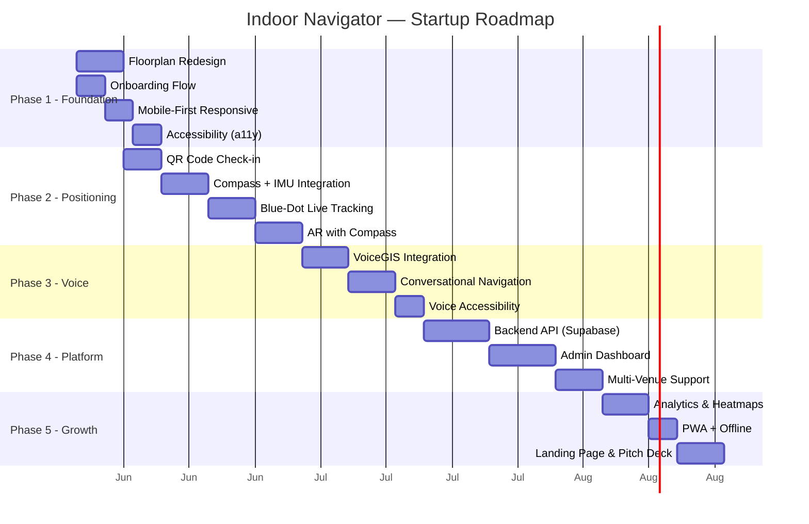

# Indoor Navigator — From MVP to World-Class Startup

## Honest Audit: Where We Are Now

Let me be direct about the current state before laying out the path forward.

### What We Have (✅ Working)
| Component | Status | Quality |
|-----------|--------|---------|
| A* Routing Engine | ✅ Functional | Solid — correct algorithm, turn-by-turn generation |
| Building Graph | ✅ Functional | Adequate — 30 nodes, extensible data model |
| Fuzzy Search | ✅ Functional | Good — trigram similarity, category filtering |
| React State Mgmt | ✅ Functional | Good — useReducer, clean action types |
| Theme Switching | ✅ Functional | Good — light/dark with localStorage |

### What's Broken or Fake (❌ Critical Gaps)
| Problem | Why It Matters |
|---------|----------------|
| **No real positioning** | User can't know where they actually ARE. The "start node" is manually set. No real user would accept this. |
| **The map is a graph, not a floorplan** | Rooms are rectangles floating on lines. Real users expect something that looks like an actual building — walls, hallways, doors. |
| **AR is a static arrow on a camera feed** | It doesn't respond to user orientation, compass, or movement. It's just a Canvas drawing on top of `getUserMedia`. Not AR in any meaningful sense. |
| **No voice commands** | Your `voice-gis` package isn't integrated. Voice is supposed to be the headline feature. |
| **No onboarding flow** | A new user lands on a map with zero context. No "Welcome to City General" → "Where are you?" → "Where do you need to go?" funnel. |
| **No accessibility** | No screen reader support, no wheelchair-accessible routing, no high-contrast mode. |
| **Single hardcoded building** | Data is embedded in JS files. Can't add a new building without changing source code. |
| **No backend** | No user accounts, no analytics, no admin dashboard, no way for a hospital to manage their own map. |

### The Core Problem
Right now, this is a **routing algorithm demo with a React UI**. It's not something a real person in a real hospital would open on their phone and use to find the ICU. For that to happen, the app needs to solve the **"where am I?"** problem and provide a **"follow me"** experience.

---

## Competitive Landscape

Before building, we need to know what "world-class" looks like:

| Company | What They Do Well | Our Differentiator |
|---------|-------------------|--------------------|
| **Mappedin** | 3D building visualization, enterprise SDK, multi-venue | We're **voice-first** + **AR-native** — they're map-first |
| **MazeMap** | Campus-scale, academic scheduling integration | We target **hospitals** — higher urgency, clearer ROI |
| **GoodMaps** | Accessibility for blind/VI users, sensor fusion | We match accessibility AND add **voice commands** as primary input |
| **Google Indoor Maps** | Massive scale, blue-dot via Wi-Fi RTT | We're **venue-specific** with deeper POI data and guided experiences |

**Our unique pitch: "The first voice-first, AR-native indoor navigation platform purpose-built for high-anxiety environments (hospitals, airports, campuses)."**

---

## Phased Roadmap



---

## Phase 1: Foundation Polish (Make It Usable)

**Goal:** Transform the demo into something a real person would not immediately close.

### 1.1 — Real Floorplan Rendering

The current map draws SVG `<line>` elements between graph nodes. This looks like a network diagram, not a building. We need to render **actual walls and rooms**.

#### Approach: GeoJSON-based Floorplan
Instead of drawing corridors as lines, we define the building geometry as polygons:

```
src/
  data/
    buildingGraph.js        ← Keep (routing graph)
    buildingGeometry.js     ← [NEW] SVG polygon data for walls, rooms, corridors
    buildingConfig.js       ← Keep
```

[buildingGeometry.js](file:///c:/Users/acer/Desktop/Working/voicegis-indoor-ar/src/data/buildingGeometry.js) will contain:
- `WALLS`: Array of SVG path strings for building walls
- `ROOMS`: Array of `{ id, path, label, category }` — closed polygons for each room
- `CORRIDORS`: Array of polygon paths for walkable hallways
- `DOORS`: Array of `{ x, y, rotation }` for door markers

The `FloorplanViewer` will render these as layered SVG groups:
1. Floor fill (light gray)
2. Corridor polygons (slightly different shade)
3. Room polygons (white with category-tinted borders)
4. Wall lines on top (dark, clean)
5. Door markers
6. Labels
7. Route overlay (on top of everything)

This creates a map that looks like an **architectural blueprint** — not a wireframe.

---

### 1.2 — Onboarding Flow

A first-time user needs to be guided. We build a 3-screen onboarding:

#### [NEW] `src/components/Onboarding.jsx`
1. **Welcome Screen**: "Welcome to City General Hospital" with building photo + "Get Started"
2. **Location Screen**: "Where are you right now?" → QR scan button OR manual selection from a visual list of landmarks (Main Entrance, Cafeteria, etc.)
3. **Destination Screen**: "Where do you need to go?" → Category quick-picks (Emergency, Pharmacy, Radiology) + search bar

After onboarding, the user lands on the map with their route already computed. This is 10x better than dumping them on a blank map.

---

### 1.3 — Mobile-First Responsive Overhaul

The current CSS doesn't properly handle small screens. We need:

- Header collapses brand text on mobile, shows only logo + toggle
- Search pill sits above the bottom safe area (respecting `env(safe-area-inset-bottom)`)
- Navigation panel respects `max-height: 50vh` on mobile with proper scroll containment
- Touch targets are all ≥44px (WCAG compliance)
- Pinch-to-zoom is smooth with proper `touch-action` management
- AR view fills the screen edge-to-edge with no header overlap

---

### 1.4 — Accessibility (a11y)

> [!IMPORTANT]
> Accessibility isn't a nice-to-have for a hospital navigation app. It's a **legal requirement** in many jurisdictions (ADA, EN 301 549) and a **moral imperative** for a product used by sick, elderly, and disabled people.

- **ARIA labels** on all interactive elements
- **Screen reader announcements** for route steps (`aria-live="polite"`)
- **Keyboard navigation** — full tab order through search, POI cards, nav steps
- **High contrast mode** — toggle in settings
- **Reduced motion** — respect `prefers-reduced-motion`
- **Wheelchair-accessible routing** — add `accessible: boolean` flag to edges, filter in A*

---

## Phase 2: Real Positioning & Live Navigation (Make It Work)

**Goal:** Solve the "where am I?" problem so the blue dot actually moves.

### 2.1 — QR Code Check-in (Day 1 Localization)

The simplest, most deployable positioning system: **print QR codes and stick them on walls**.

#### How It Works
1. Hospital prints QR codes that encode a node ID: `https://nav.hospital.com/locate?node=j5&floor=1`
2. User scans QR code with their phone camera (or the in-app scanner)
3. App sets `startNodeId` to that node
4. Blue dot appears at the correct location

#### [NEW] `src/components/QRScanner.jsx`
- Uses `navigator.mediaDevices.getUserMedia` (we already have this for AR)
- Decodes QR via a lightweight library like `jsQR` (no native dependencies)
- Validates the scanned node ID against the building graph
- Sets the user's position with a confirmation animation

> [!TIP]
> This is the **most cost-effective positioning system possible**. Zero hardware cost. Works on any phone. Perfect for MVP deployment.

---

### 2.2 — Compass + IMU Integration (Device Orientation)

Once we know WHERE the user is, we need to know which DIRECTION they're facing.

#### [NEW] `src/hooks/useDeviceOrientation.js`
```js
// Listens to DeviceOrientationEvent
// Returns { heading, pitch, roll } in degrees
// Heading = compass direction the phone is pointing
// This makes the AR arrow actually point in the right direction
```

#### [NEW] `src/hooks/usePedestrianDeadReckoning.js`
```js
// Uses accelerometer data to estimate steps
// Each step advances the blue dot along the route path
// Combined with compass heading for direction
// This gives us "follow me" navigation without any hardware
```

---

### 2.3 — Blue-Dot Live Tracking

With QR check-in + PDR (Pedestrian Dead Reckoning), we can show a moving blue dot:

- Blue dot position updates as user walks
- Map auto-pans to keep the blue dot centered
- Current step in navigation panel auto-advances when user reaches the next turn
- "Re-center" button snaps the map back to the user's position

---

### 2.4 — AR with Real Compass

The current AR is fake — it draws the same arrow regardless of which direction the phone points. With compass data:

- Arrow rotates based on the bearing difference between the user's heading and the next waypoint
- When user faces the right direction, arrow turns green with a "You're on track" indicator
- When user faces the wrong direction, arrow turns red and shows "Turn around"
- Distance to next waypoint updates in real-time based on PDR

---

## Phase 3: Voice Integration (Our Differentiator)

**Goal:** Make "voice-first" a reality, not just a tagline.

### 3.1 — VoiceGIS Integration

#### [NEW] `src/voice/VoiceController.js`
- Import and initialize the `voice-gis` library
- Create a custom `IndoorMapAdapter` that connects VoiceGIS commands to our navigation context
- Map VoiceGIS intents to actions:

| Voice Command | VoiceGIS Intent | App Action |
|---------------|-----------------|------------|
| "Take me to the pharmacy" | `navigate_to` | `actions.navigateTo('pharmacy')` |
| "Where is the ICU?" | `search_poi` | `actions.selectPOI(icuNode)` |
| "How far is radiology?" | `query_distance` | Show distance toast |
| "Cancel navigation" | `cancel` | `actions.clearRoute()` |
| "Next step" | `nav_next` | `actions.nextStep()` |
| "What floor am I on?" | `query_floor` | Announce current floor |

### 3.2 — Conversational Navigation

Voice shouldn't be just commands — it should be a **conversation**:

#### [NEW] `src/components/VoiceAssistant.jsx`
- Floating microphone button (like Google Assistant)
- Tap-to-talk with visual waveform animation
- Text-to-speech responses: "The pharmacy is 45 meters away, about 38 seconds walk. Shall I navigate you there?"
- Ambient listening mode (optional) for hands-free turn-by-turn: "Turn left now. The pharmacy is on your right in 10 meters."

### 3.3 — Voice Accessibility
- Voice commands work as a **complete alternative** to touch
- "Read my options" announces all POIs in the current category
- "Describe my surroundings" reads nearby POIs based on current position
- Full TTS for all navigation steps, automatically announced as user walks

---

## Phase 4: Platform (Make It Scalable)

**Goal:** Transform from a single-hospital demo to a multi-venue platform that hospitals can self-serve.

### 4.1 — Backend API

#### Technology: Supabase (or Firebase)
- **Auth**: Hospital admin accounts, visitor anonymous sessions
- **Database**: Building configs, floorplan geometry, POI metadata, route analytics
- **Storage**: Floorplan SVGs, QR code PDFs, building photos
- **Realtime**: Live navigation session tracking (for analytics)

#### [NEW] API Schema
```
buildings/
  ├── {building_id}/
  │   ├── config.json          (name, address, floors, settings)
  │   ├── floors/
  │   │   ├── {floor_id}/
  │   │   │   ├── geometry.json    (walls, rooms, corridors as GeoJSON)
  │   │   │   ├── graph.json       (nodes + edges for routing)
  │   │   │   └── pois.json        (POI metadata)
  │   └── assets/
  │       ├── logo.png
  │       └── qr-codes.pdf
```

### 4.2 — Admin Dashboard

#### [NEW] Separate Vite app or route: `/admin`
- **Map Editor**: Upload an SVG/PNG floorplan, draw rooms on top, place POI pins
- **POI Manager**: CRUD for rooms/departments with categories, descriptions, hours
- **QR Code Generator**: Auto-generate printable QR codes for every POI
- **Analytics Dashboard**: Most-searched destinations, average navigation time, user flow heatmaps
- **Settings**: Building name, theme colors, floor configuration

### 4.3 — Multi-Venue & Multi-Floor

- Floor switcher in the header (already have the button, needs functionality)
- Elevator/stairway nodes that connect floors
- Routing engine handles floor transitions: "Take elevator to Floor 2, then turn right"
- Building selector for organizations with multiple locations

---

## Phase 5: Growth & Monetization

**Goal:** Make it investor-ready with proven traction metrics.

### 5.1 — Analytics & Heatmaps
- Track anonymous navigation sessions
- Generate heatmaps of most-visited areas
- Identify bottleneck corridors (where people get lost)
- Dashboard for hospital operations team

### 5.2 — PWA + Offline Mode
- Service worker for offline map caching
- App installs to home screen
- Works without internet after initial load (critical for hospital basements with poor signal)

### 5.3 — Landing Page & Pitch Deck
- Marketing site: `indoornav.app`
- Demo video showing the full flow: scan QR → voice command → AR navigation → arrive
- Pitch deck with TAM/SAM/SOM for indoor navigation market ($23.6B by 2028)

---

## Monetization Model

| Tier | Price | Features |
|------|-------|----------|
| **Free** | $0 | 1 building, 1 floor, 50 POIs, basic analytics |
| **Pro** | $99/mo | 5 buildings, unlimited floors, voice nav, AR, full analytics |
| **Enterprise** | Custom | Unlimited venues, SSO, API access, custom branding, SLA |

---

## Recommended Execution Order

For maximum impact with minimum effort, I recommend this sequence:

1. **Phase 1.1 + 1.2** first — Floorplan redesign + onboarding. This is the highest-impact visual change. After this, the app will *look* like a real product.
2. **Phase 2.1** — QR code localization. This makes the "where am I?" problem solvable TODAY with zero hardware.
3. **Phase 3.1** — VoiceGIS integration. This activates your unique differentiator.
4. **Phase 1.3 + 1.4** — Mobile responsive + accessibility. Polish for real-device testing.
5. **Phase 2.2-2.4** — Compass/IMU/live tracking. This makes navigation feel magical.
6. **Phase 3.2-3.3** — Conversational voice. Premium experience.
7. **Phase 4** — Backend + admin. Scale to multiple venues.
8. **Phase 5** — Growth. Prove traction, raise funding.

---

## Open Questions

> [!IMPORTANT]
> **Do you want to start with Phase 1 (Foundation Polish)?** This would involve me redesigning the floorplan from a graph to an actual building layout with walls and rooms, and building the onboarding flow. This is the single highest-impact change we can make right now.

> [!NOTE]
> **Backend choice:** I suggested Supabase because it's fast to set up and has a generous free tier. Would you prefer Firebase, a custom Node/Express backend, or something else?

> [!NOTE]
> **Deployment target:** Are you planning to deploy this as a web app (Vercel/Netlify), a PWA, or do you eventually want native mobile apps (React Native)?
